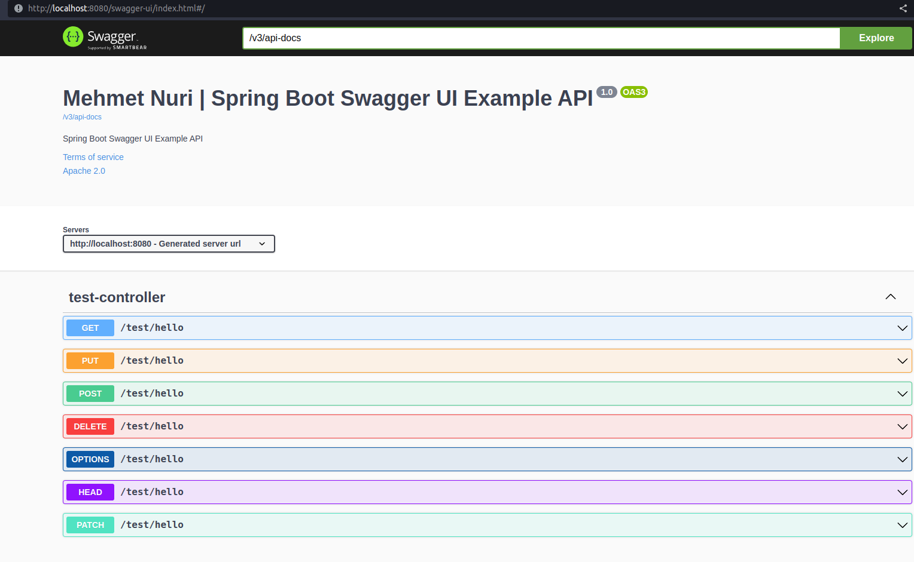

# Spring Boot  Swagger UI  Example

This is a simple example of how to use Swagger UI with Spring Boot.

## How to run

```bash
mvn spring-boot:run
```

## How to use

Open your browser and go to [http://localhost:8080/swagger-ui/index.html](http://localhost:8080/swagger-ui/index.html)
You should see the Swagger UI page.

## Screenshots




# How to add Swagger UI to your Spring Boot project

## Add Swagger UI Dependency

Add the following dependency to your `pom.xml` file:

```xml
<dependency>
    <groupId>org.springdoc</groupId>
    <artifactId>springdoc-openapi-starter-webmvc-ui</artifactId>
    <version>2.0.3</version>
</dependency>
```

## Add Swagger UI configuration

Edit the `SwaggerConfig.java` file and add the following code:

```java

@Configuration

public class SwaggerConfig {

    @Bean

    public OpenAPI customOpenAPI() {

        return new OpenAPI()

                .info(new Info()
                        .title("Spring Boot Swagger UI Example")
                        .version("1.0")
                        .description("Spring Boot Swagger UI Example API")
                        .termsOfService("http://swagger.io/terms/")
                        .license(new License().name("Apache 2.0").url("http://springdoc.org")));
    }
}
```